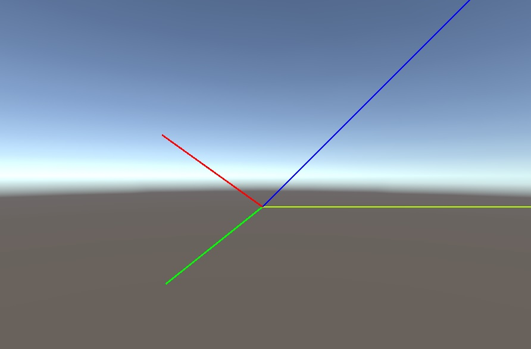

Simple to use Debug.DrawLine() replacement.
Uses LineRenderers so that it shows up at runtime as well as in webgl apps.

Steps:
1. Simply add the "DrawLine" folder to your project. 
2. Add the DrawLine prefab to the scene.
3. Used "Draw.DrawLine()" in place of Debug.DrawLine() in your scripts.

Enjoy!

(Note: I originally tried GL.LINES however it was problematic after a compiled project. This is the better option.)
Demo here: https://freegamedev.itch.io/drawline
